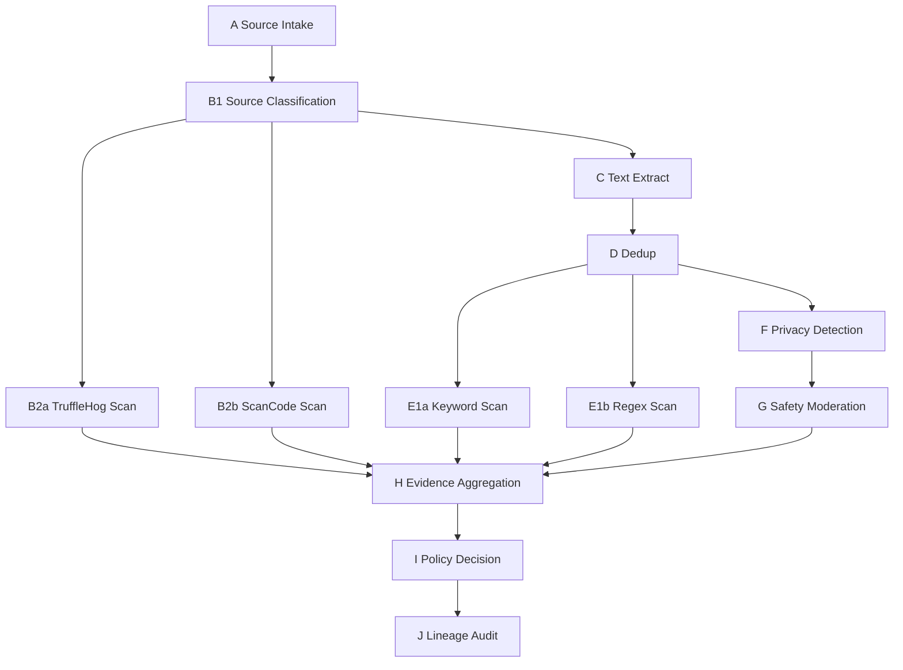

# Text Data Compliance Checker

## 1. 项目概述

这是一个面向文本数据的合规检测微服务，按照 A→J 的流水线执行：

A 输入接入 → B1 来源分类 → B2 原始对象扫描（密钥/许可证）→ C 文本提取清洗 → D 去重 → E1 规则扫描（关键词/正则）→ F 隐私检测脱敏 → G 安全审核 → H 证据聚合 → I 策略决策 → J 血缘审计。

当前仓库中存在两条文本服务入口：

- 旧链：`text/server.py`
- 推荐本地模型优先链：`text/api_server.py`

如果你要按当前最终改造方向启动文本合规服务，优先参考：

- [`text/LOCAL_MODEL_PIPELINE.md`](./LOCAL_MODEL_PIPELINE.md)

旧链说明仍然保留在本 README 和 `text/server.py` 相关内容中。

---

## 2. 审查结论（基于源码 + resolved 文档）

### 2.1 与 implementation_plan.md.resolved / walkthrough.md.resolved 的一致项

- 目录结构完整，A→J 各步骤模块均存在并可调用。
- `pipeline.py` 中 B2a/B2b、E1a/E1b 已通过 `ThreadPoolExecutor` 并行执行。
- 每步产物按 JSONL/JSON 输出到 `work_dir/run_id/`。
- FastAPI 关键接口齐全：
  - `POST /api/v1/check`
  - `GET /api/v1/status/{task_id}`
  - `GET /api/v1/result/{task_id}`
  - `GET /api/v1/health`
- OPA + 本地规则引擎双通路存在（优先 OPA，失败回落本地规则）。
- OpenLineage 具备 Console/HTTP 两种传输。

### 2.2 审查发现的差异与注意点（不涉及代码修改）

1. `a_source_intake.py` 的实现仅处理本地文件/目录，未实现 URL 拉取逻辑（计划文档写了“文件路径/URL/目录”）。
2. `d_dedup.py` 文档写“Primary Duplodocus”，实际代码未调用 Duplodocus CLI，当前落地为“精确哈希 + datasketch MinHash LSH”。
3. `b1_source_classify.py` 将 `.txt/.md` 归类为 `web_text`，并在 C 步优先走 HTML 提取；虽然有 fallback，但语义上与“纯文本”直读路径略有偏差。
4. `f_privacy_detection.py` 配置支持 `en/zh`，但 NLP engine 显式仅加载 `en_core_web_sm`，中文识别效果可能依赖回退路径。
5. `server.py` 额外提供了 `GET /api/v1/tasks`（resolved 文档未强调，但是有效扩展）。

---

## 3. 架构与执行流



并行点：
- B2a 与 B2b 并行
- E1a 与 E1b 并行

---

## 4. 模块解读

### 4.1 配置与模型

- `config/settings.py`
  - 使用 `pydantic-settings` 统一读取 `COMPLIANCE_*` 环境变量与 `.env`
  - 包含工具路径、阈值、模型配置、OPA 与 OpenLineage 地址等
- `models/schemas.py`
  - 定义所有步骤输入/输出模型（SourceRecord、DedupDocument、PrivacyResult、PolicyDecision 等）
  - API 请求与任务状态模型也在此定义（CheckRequest、CheckTaskInfo）

### 4.2 步骤模块（A→J）

- A `steps/a_source_intake.py`
  - 遍历本地路径并生成 `SourceRecord`
  - 计算 SHA-256、MIME、文件大小
- B1 `steps/b1_source_classify.py`
  - 基于扩展名/MIME 映射为 `code/repo/package/binary/web_text/pdf_text/mixed`
- B2a `steps/b2a_trufflehog_scan.py`
  - 通过 TruffleHog CLI 扫描 secrets，解析 JSON 行输出为 `SecretHit`
- B2b `steps/b2b_scancode_scan.py`
  - 通过 ScanCode CLI 解析许可证和版权结果为 `ComplianceHit`
- C `steps/c_text_extract.py`
  - HTML 优先 `trafilatura`，PDF 走 PyMuPDF，其余文本直读
  - 统一做 Unicode 规范化、空白压缩、语言检测
- D `steps/d_dedup.py`
  - 第一阶段：文本哈希精确去重
  - 第二阶段：MinHash LSH 近似去重（`datasketch`）
- E1a `steps/e1a_keyword_scan.py`
  - 从 `config/keywords.txt` 加载词库，优先 FlashText2 扫描
- E1b `steps/e1b_regex_scan.py`
  - 从 `config/patterns.yaml` 加载模式，优先 Hyperscan，回退 Python `re`
- F `steps/f_privacy_detection.py`
  - Presidio 检测 + Anonymizer 脱敏
  - 可选接 HuggingFace NER 作为增强识别器
- G `steps/g_safety_moderation.py`
  - 优先 Qwen3Guard 分类 Safe/Controversial/Unsafe
  - 模型不可用时使用关键词 mock 分类器
- H `steps/h_evidence_aggregation.py`
  - 以文档维度聚合各步骤证据并计算 summary
- I `steps/i_policy_decision.py`
  - 优先调用 OPA REST API
  - 回退本地规则引擎：secrets/safety/privacy/compliance/text_scan 五维评分
- J `steps/j_lineage_audit.py`
  - 发出 START/COMPLETE/FAIL 事件到 OpenLineage

### 4.3 编排与服务

- `pipeline.py`
  - `CompliancePipeline.execute(input_paths)` 串联 A→I
  - 每步统一调用 `_run_step`，内置 lineage 事件与异常处理
- `server.py`
  - 后台任务方式提交流水线执行
  - 内存任务表 `_tasks` 保存状态与结果

---

## 5. 输出产物说明

单次运行输出目录：`{COMPLIANCE_WORK_DIR}/{run_id}/`

主要文件：
- `source_registry.jsonl`
- `source_profile.jsonl`
- `raw_secret_hits.jsonl`
- `source_compliance.jsonl`
- `cleaned_documents.jsonl`
- `deduped_documents.jsonl`
- `dedup_map.jsonl`
- `keyword_hits.jsonl`
- `regex_hits.jsonl`
- `privacy_checked.jsonl`
- `safety_checked.jsonl`
- `evidence_bundle.json`
- `decision.json`

---

## 6. Fallback 机制总览

- TruffleHog/ScanCode 缺失：记录 warning，返回空结果（对应步骤不中断主流程）
- Trafilatura 缺失：HTML 使用简单标签剥离
- PyMuPDF 缺失：PDF 提取跳过
- datasketch 缺失：近似去重跳过，仅保留非重复标记流程
- FlashText2 缺失：改用 `str.find` 扫描
- Hyperscan 缺失：改用 Python `re`
- Presidio 缺失：隐私步骤透传原文
- Qwen3Guard 不可用：回退 mock 分类
- OPA 不可用：回退本地规则引擎
- OpenLineage 不可用：仅日志输出

---

## 7. 运行方式

### 7.1 本地开发

```bash
cd text
pip install -r requirements.txt
python -m spacy download en_core_web_sm
python server.py
```

服务默认监听：`http://localhost:9000`

### 7.2 Docker

```bash
cd text
docker compose up --build
```

- text-checker: `:9000`
- OPA: `:8181`

### 7.3 API 示例

```bash
curl -X POST http://localhost:9000/api/v1/check \
  -H "Content-Type: application/json" \
  -d '{"input_paths": ["/path/to/data"]}'

curl http://localhost:9000/api/v1/status/{task_id}
curl http://localhost:9000/api/v1/result/{task_id}
curl http://localhost:9000/api/v1/health
```

---

## 8. 测试现状

- 测试文件：`text/tests/test_pipeline.py`
- 覆盖内容：A/B1/C/D/E1/Fallback G/H/I 与 FastAPI 基础接口
- 当前审查中未修改任何代码文件

---

## 9. 建议关注点（后续可选优化）

1. 补齐 URL 输入抓取能力，使 A 步与设计文档完全一致。
2. 若要严格区分 HTML 与纯文本，可调整 B1 分类策略或 C 步分派策略。
3. 如需中文 PII 高质量识别，可为 Presidio 增配中文 NLP engine。
4. 若生产追求更高性能，可补充 Duplodocus CLI 路径并与 datasketch 对比。

---

## 10. 版本信息

- 包版本：`text/__init__.py` 中 `__version__ = "0.1.0"`
- 本 README 生成时间：2026-03-24
- 本 README 基于代码审查结果自动整理，仅文档新增，不包含源码改动。
